# Tech 258 - Ansible

## Ansible Overview
Ansible is an open-source automation tool used for configuration management. It simplifies the process of managing complex infrastructure by allowing users to define and automate tasks using simple, human-readable YAML syntax. 

Ansible is agentless, meaning it does not require any additional software to be installed on managed nodes, making it easy to deploy and use across a wide range of environments.


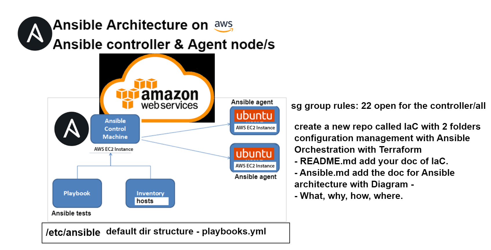

### Diagram Explanation
- Ansible Control Machine: This is the primary machine, think of the Master node in which commands are executed. It can manage ansible agents like AWS EC2 instances.

- Ansible Agents: Represents a managed node in AWS cloud which are controlled by the Ansible Control Machine

- Playbook: A directory under the AWS EC2 instance, containing playbooks and tests. The default directory structure for playbooks is `/etc/ansible/playbooks.yml`.

## Configuring Ansible Control Machine
### Installing Ansible
1) Run an update & upgrade in all three instances -> This will make sure there is internet, public access and missing dependencies will be patched. 
2) `sudo apt-get install software-properties-common` - patches missing dependencies
3) `sudo apt-add-repository ppa:ansible/ansible` - download whats needed to run ansible
4) `sudo apt-get update` - refresh local package list now
5) `sudo apt-get install ansible -y` - install ansible
6) `sudo ansible --version` - check if ansible has been installed correctly (v2.9.27).

Example: <br>
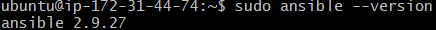

We have now installed Ansible on our controller node successfully! Time to configure it!

### Configuring the Controller
1) `cd /etc/ansible` - go to ansible config directory. Our directory would look like this by default: <br>
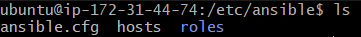
2) `sudo ansible web -m ping` - This command will ping a message and ask for the status of the ansible agent. First try: <br>
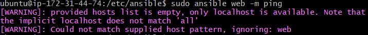

    The error shows that only localhost is available i.e. no hosts have been provided in our `hosts` file. Therefore, for this to work we have to provide public ip of our `web` and `db` agents in the `hosts` file. Run the command `sudo nano hosts`. Example: <br>
    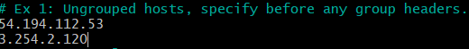

    Now that we have done this we can try the `ping` again. Second try: <br>
    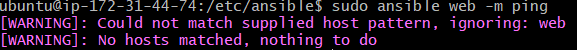

    We now have to group our hosts. As we tried to ping `web` we therefore have to group the corresponding IP with that, and do the same with the `db`. 

    Now that we have done this we can try the `ping` again. Third try: <br>
    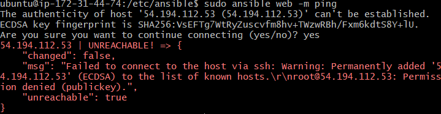

    We are now getting a permission denied error (`UNREACHABLE!`) so we have to give the controller credentials. We have to first put our corresponding private key so that the controller can SSH into our agents (via SCP command). We can now reference our private key path. Do this by updating our `hosts` file again. Example: <br>
    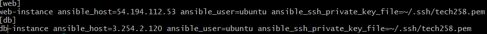

    Now that we have grouped our public IP's and given the controller credentials ping should now work. Final try: <br>
    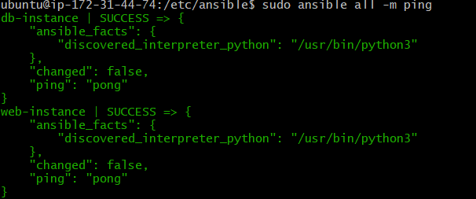

We have now correctly troubleshooted our ping command. Now that we know that our controller can communicate with our agents we can move on.

## Adhoc commands:
### What are adhoc commands?
Adhoc commands are one-off commands that are executed on the command line of the Ansible Control Machine.

### Why use them?
Despite not being reusable, adhoc commands are an easy way of leveraging Ansible without the need for a playbook or any additional configuration. Therefore, these commands are great for completing tasks quickly as you only need to execute a quick one-liner! 

### How do we use them?
An adhoc command looks like this:
```
ansible <pattern> -m <module> -a "<module options>"
```

Breaking down the command:
`-m` - Specify the Ansible Module you would like to use.
`-a` - Specify the argument here.

### Example adhoc commands
- `sudo ansible all -a "uname -a"` - Gives us system information about our ansible agents from controller. Example: <br>
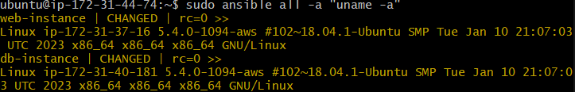

- `sudo ansible all -a "free"` - Gives us information about free space in our ansible agents. Example: <br>
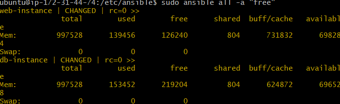

- `sudo ansible all -a "date"` - Give us the date/time of our ansible agents. Example: <br>
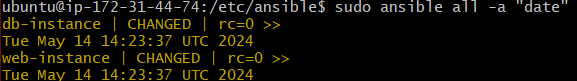

- `sudo ansible all -a "ls"` - Lists home directories of our ansible agents. Example: <br>
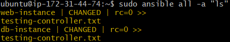

- `sudo ansible all -a "sudo apt-get update -y"` - Updates local package list on our ansible agents. Example: <br>
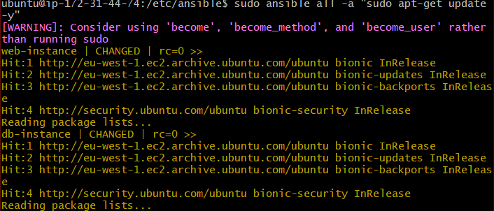

  